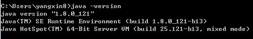

# 1-1,快速搭建你的Spark开发环境


### 一，搭建本地pyspark单机练习环境


以下过程本地单机版pyspark练习编程环境的配置方法。

注意：仅配置练习环境无需安装hadoop,无需安装scala.


**1，安装Java8**

下载地址：https://www.oracle.com/technetwork/java/javase/downloads/jdk8-downloads-2133151.html

注意避免安装其它版本的jdk否则可能会有不兼容spark的情况。
注意设置JAVA_HOME，并添加它到默认路径PATH中

WINDOWS下安装jdk8详细教程可以参考：

https://www.cnblogs.com/heqiyoujing/p/9502726.html

<br/>

安装成功后，在命令行中输入 java -version，可以看到类似如下的结果。




**2，下载解压spark**

spark官网下载: http://spark.apache.org/downloads.html

百度云盘链接: https://pan.baidu.com/s/1mUMavclShgvigjaKwoSF_A  密码:fixh

下载后解压放入到一个常用软件的安装路径，如：

/Users/liangyun/ProgramFiles/spark-3.0.1-bin-hadoop3.2


<!-- #region -->
对于Linux用户，和mac用户，建议像如下方式在~/.bashrc中设置环境变量，以便可以启动spark-submit和spark-shell。

windows用户可以忽略以下设置。

```bash

export PYTHONPATH=$/Users/liangyun/anaconda3/bin/python
export PATH="/Users/liangyun/anaconda3/bin:${PATH}"

export JAVA_HOME=/Library/Java/JavaVirtualMachines/jdk1.8.0_172.jdk/Contents/Home
export SPARK_HOME="/Users/liangyun/ProgramFiles/spark-3.0.1-bin-hadoop3.2"

export PYSPARK_PYTHON=$PYTHONPATH
export PYSPARK_DRIVER_PYTHON=$PYTHONPATH
export PYSPARK_DRIVER_PYTHON_OPTS='notebook'

```
<!-- #endregion -->

<!-- #region -->
**3，安装findspark**

```python
!pip install findspark
```

安装成功后可以在jupyter中运行如下代码
<!-- #endregion -->

```python
import findspark

#指定spark_home为刚才的解压路径,指定python路径
spark_home = "/Users/liangyun/ProgramFiles/spark-3.0.1-bin-hadoop3.2"
python_path = "/Users/liangyun/anaconda3/bin/python"
findspark.init(spark_home,python_path)

```

```python
import pyspark 
from pyspark import SparkContext, SparkConf
conf = SparkConf().setAppName("test").setMaster("local[4]")
sc = SparkContext(conf=conf)

print("spark version:",pyspark.__version__)
rdd = sc.parallelize(["hello","spark"])
print(rdd.reduce(lambda x,y:x+' '+y))

```

```
spark version: 3.0.1
hello spark
```

```python

```

<!-- #region -->
**4，救命方案**

如果以上过程由于java环境配置等因素没能成功安装pyspark。

可以在和鲸社区的云端notebook环境中直接学习pyspark。

和鲸社区的云端notebook环境中已经安装好了pyspark。


https://www.kesci.com/home/column/5fe6aa955e24ed00302304e0

<!-- #endregion -->

```python

```

<!-- #region -->
### 二，运行pyspark的各种方式

<br/>


pyspark主要通过以下一些方式运行。

1，通过pyspark进入pyspark单机交互式环境。

这种方式一般用来测试代码。

也可以指定jupyter或者ipython为交互环境。

<br/>


**2，通过spark-submit提交Spark任务到集群运行。**

这种方式可以提交Python脚本或者Jar包到集群上让成百上千个机器运行任务。

这也是工业界生产中通常使用spark的方式。

<br/>

3，通过zepplin notebook交互式执行。

zepplin是jupyter notebook的apache对应产品。


<br/>

**4, Python安装findspark和pyspark库。**

可以在jupyter和其它Python环境中像调用普通库一样地调用pyspark库。

这也是本书配置pyspark练习环境的方式。


<!-- #endregion -->

```python

```

<!-- #region -->
### 三，通过spark-submit提交任务到集群运行常见问题

<br/>


以下为在集群上运行pyspark时相关的一些问题，

1，pyspark是否能够调用Scala或者Java开发的jar包？

答：只有Driver中能够调用jar包，通过Py4J进行调用，在excutors中无法调用。

2，pyspark如何在excutors中安装诸如pandas,numpy等包？

答：可以通过conda建立Python环境，然后将其压缩成zip文件上传到hdfs中，并在提交任务时指定环境。
当然，最简单直接的方案是把你想要的anaconda环境打包成zip上传到集群hdfs环境中。
注意，你打包的机器应当和集群的机器具有相同的linux操作系统。


3，pyspark如何添加自己编写的其它Python脚本到excutors中的PYTHONPATH中？

答：可以用py-files参数设置，可以添加.py,.egg 或者压缩成.zip的Python脚本，在excutors中可以import它们。

4，pyspark如何添加一些配置文件到各个excutors中的工作路径中？

答：可以用files参数设置，不同文件名之间以逗号分隔，在excutors中用SparkFiles.get(fileName)获取。
<!-- #endregion -->

<!-- #region -->

```bash
#提交python写的任务
spark-submit --master yarn \
--deploy-mode cluster \
--executor-memory 12G \
--driver-memory 12G \
--num-executors 100 \
--executor-cores 2 \
--conf spark.yarn.maxAppAttempts=2 \
--conf spark.default.parallelism=1600 \
--conf spark.sql.shuffle.partitions=1600 \
--conf spark.memory.offHeap.enabled=true \
--conf spark.memory.offHeap.size=2g\
--conf spark.task.maxFailures=10 \
--conf spark.stage.maxConsecutiveAttempts=10 \
--conf spark.yarn.appMasterEnv.PYSPARK_PYTHON=./anaconda3.zip/anaconda3/bin/python #指定excutors的Python环境
--conf spark.yarn.appMasterEnv.PYSPARK_DRIVER_PYTHON = ./anaconda3.zip/anaconda3/bin/python  #cluster模式时候设置
--archives viewfs:///user/hadoop-xxx/yyy/anaconda3.zip #上传到hdfs的Python环境
--files  data.csv,profile.txt
--py-files  pkg.py,tqdm.py
pyspark_demo.py 
```
<!-- #endregion -->

```python

```

**如果本书对你有所帮助，想鼓励一下作者，记得给本项目加一颗星星star⭐️，并分享给你的朋友们喔😊!** 

如果对本书内容理解上有需要进一步和作者交流的地方，欢迎在公众号"算法美食屋"下留言。作者时间和精力有限，会酌情予以回复。

也可以在公众号后台回复关键字：**spark加群**，加入spark和大数据读者交流群和大家讨论。


