# 1-2,60分钟看懂Spark的基本原理


<!-- #region -->
#### 一，Spark优势特点

作为大数据计算框架MapReduce的继任者，Spark具备以下优势特性。

**1，高效性**

不同于MapReduce将中间计算结果放入磁盘中，Spark采用内存存储中间计算结果，减少了迭代运算的磁盘IO，并通过并行计算DAG图的优化，减少了不同任务之间的依赖，降低了延迟等待时间。内存计算下，Spark 比 MapReduce 快100倍。

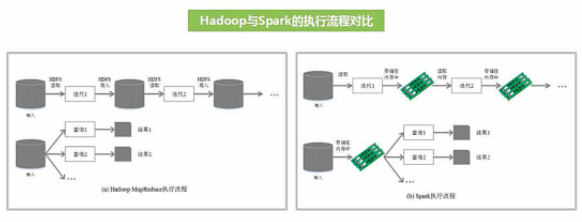

<br/>


**2，易用性**

不同于MapReduce仅支持Map和Reduce两种编程算子，Spark提供了超过80种不同的Transformation和Action算子，如map,reduce,filter,groupByKey,sortByKey,foreach等，并且采用函数式编程风格，实现相同的功能需要的代码量极大缩小。

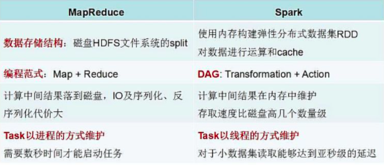


**3，通用性**

Spark提供了统一的解决方案。Spark可以用于批处理、交互式查询（Spark SQL）、实时流处理（Spark Streaming）、机器学习（Spark MLlib）和图计算（GraphX）。

这些不同类型的处理都可以在同一个应用中无缝使用。这对于企业应用来说，就可使用一个平台来进行不同的工程实现，减少了人力开发和平台部署成本。


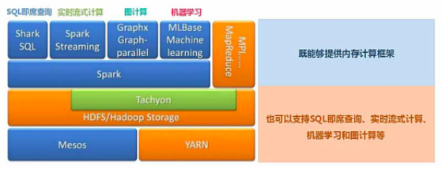


**4，兼容性**

Spark能够跟很多开源工程兼容使用。如Spark可以使用Hadoop的YARN和Apache Mesos作为它的资源管理和调度器，并且Spark可以读取多种数据源，如HDFS、HBase、MySQL等。

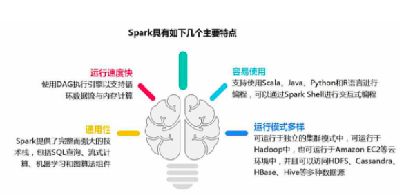


<!-- #endregion -->

<!-- #region -->
#### 二，Spark基本概念

<br/>


RDD：是弹性分布式数据集（Resilient Distributed Dataset）的简称，是分布式内存的一个抽象概念，提供了一种高度受限的共享内存模型。

DAG：是Directed Acyclic Graph（有向无环图）的简称，反映RDD之间的依赖关系。

Driver Program：控制程序，负责为Application构建DAG图。

Cluster Manager：集群资源管理中心，负责分配计算资源。

Worker Node：工作节点，负责完成具体计算。

Executor：是运行在工作节点（Worker Node）上的一个进程，负责运行Task，并为应用程序存储数据。

Application：用户编写的Spark应用程序，一个Application包含多个Job。

Job：作业，一个Job包含多个RDD及作用于相应RDD上的各种操作。

Stage：阶段，是作业的基本调度单位，一个作业会分为多组任务，每组任务被称为“阶段”。

Task：任务，运行在Executor上的工作单元，是Executor中的一个线程。

总结：Application由多个Job组成，Job由多个Stage组成，Stage由多个Task组成。Stage是作业调度的基本单位。


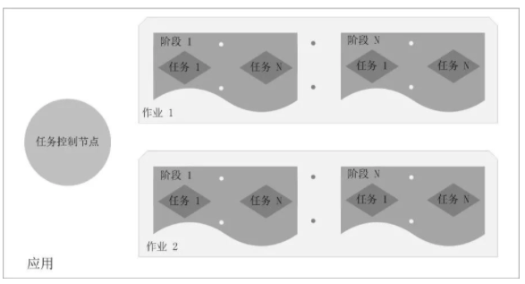
<!-- #endregion -->


<!-- #region -->
#### 三，Spark架构设计

Spark集群由Driver, Cluster Manager（Standalone,Yarn 或 Mesos），以及Worker Node组成。对于每个Spark应用程序，Worker Node上存在一个Executor进程，Executor进程中包括多个Task线程。

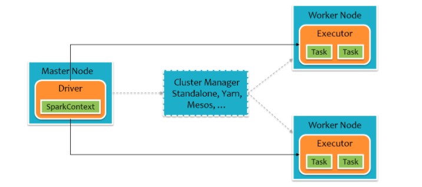


对于pyspark,为了不破坏Spark已有的运行时架构，Spark在外围包装一层Python API。在Driver端，借助Py4j实现Python和Java的交互，进而实现通过Python编写Spark应用程序。在Executor端，则不需要借助Py4j，因为Executor端运行的Task逻辑是由Driver发过来的，那是序列化后的字节码。

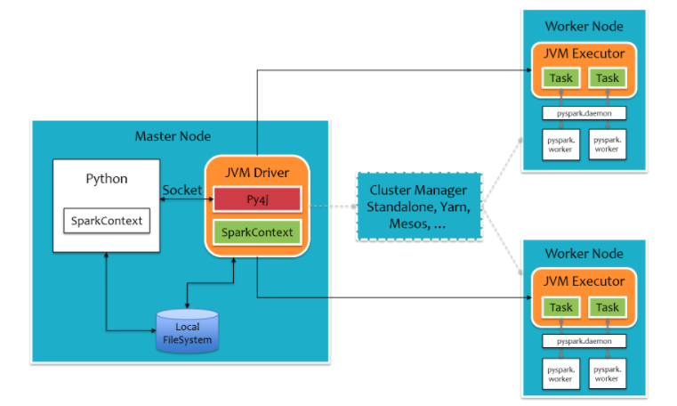


<!-- #endregion -->

<!-- #region -->


#### 四，Spark运行流程

1，Application首先被Driver构建DAG图并分解成Stage。

2，然后Driver向Cluster Manager申请资源。

3，Cluster Manager向某些Work Node发送征召信号。

4，被征召的Work Node启动Executor进程响应征召，并向Driver申请任务。

5，Driver分配Task给Work Node。

6，Executor以Stage为单位执行Task，期间Driver进行监控。

7，Driver收到Executor任务完成的信号后向Cluster Manager发送注销信号。

8，Cluster Manager向Work Node发送释放资源信号。

9，Work Node对应Executor停止运行。

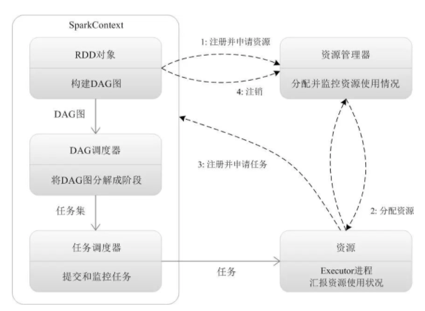

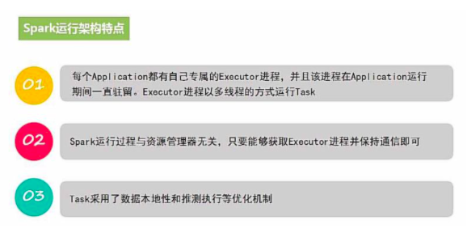
<!-- #endregion -->

#### 五，Spark部署模式

Local：本地运行模式，非分布式。

Standalone：使用Spark自带集群管理器，部署后只能运行Spark任务。

Yarn：Haoop集群管理器，部署后可以同时运行MapReduce，Spark，Storm，Hbase等各种任务。

Mesos：与Yarn最大的不同是Mesos 的资源分配是二次的，Mesos负责分配一次，计算框架可以选择接受或者拒绝。

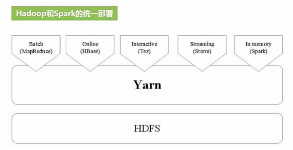


#### 六，RDD数据结构

RDD全称Resilient Distributed Dataset，弹性分布式数据集，它是记录的只读分区集合，是Spark的基本数据结构。

RDD代表一个不可变、可分区、里面的元素可并行计算的集合。

一般有两种方式创建RDD，第一种是读取文件中的数据生成RDD，第二种则是通过将内存中的对象并行化得到RDD。

```python


#通过读取文件生成RDD
rdd = sc.textFile("hdfs://hans/data_warehouse/test/data")


#通过将内存中的对象并行化得到RDD
arr = [1,2,3,4,5]
rdd = sc.parallelize(arr)


```

<!-- #region -->
创建RDD之后，可以使用各种操作对RDD进行编程。

RDD的操作有两种类型，即Transformation操作和Action操作。转换操作是从已经存在的RDD创建一个新的RDD，而行动操作是在RDD上进行计算后返回结果到 Driver。

Transformation操作都具有 Lazy 特性，即 Spark 不会立刻进行实际的计算，只会记录执行的轨迹，只有触发Action操作的时候，它才会根据 DAG 图真正执行。

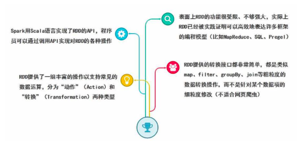


操作确定了RDD之间的依赖关系。

RDD之间的依赖关系有两种类型，即窄依赖和宽依赖。窄依赖时，父RDD的分区和子RDD的分区的关系是一对一或者多对一的关系。而宽依赖时，父RDD的分区和自RDD的分区是一对多或者多对多的关系。

宽依赖关系相关的操作一般具有shuffle过程，即通过一个Patitioner函数将父RDD中每个分区上key不同的记录分发到不同的子RDD分区。


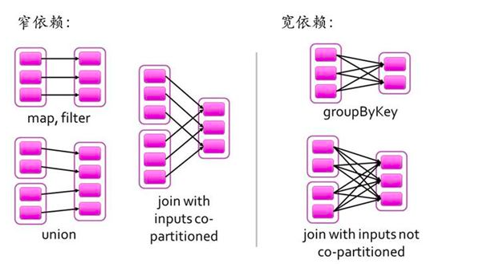


依赖关系确定了DAG切分成Stage的方式。

切割规则：从后往前，遇到宽依赖就切割Stage。

RDD之间的依赖关系形成一个DAG有向无环图，DAG会提交给DAGScheduler，DAGScheduler会把DAG划分成相互依赖的多个stage，划分stage的依据就是RDD之间的宽窄依赖。遇到宽依赖就划分stage,每个stage包含一个或多个task任务。然后将这些task以taskSet的形式提交给TaskScheduler运行。


<!-- #endregion -->

#### 七，WordCount范例

```python
import findspark

#指定spark_home为刚才的解压路径,指定python路径
spark_home = "/Users/liangyun/ProgramFiles/spark-3.0.1-bin-hadoop3.2"
python_path = "/Users/liangyun/anaconda3/bin/python"
findspark.init(spark_home,python_path)
```

```python
import pyspark 
from pyspark import SparkContext, SparkConf
conf = SparkConf().setAppName("test").setMaster("local[4]")
sc = SparkContext(conf=conf)
```

只需要5行代码就可以完成WordCount词频统计。

```python
rdd_line = sc.textFile("./data/hello.txt")
rdd_word = rdd_line.flatMap(lambda x:x.split(" "))
rdd_one = rdd_word.map(lambda t:(t,1))
rdd_count = rdd_one.reduceByKey(lambda x,y:x+y)
rdd_count.collect() 
```

```
[('world', 1),
 ('love', 3),
 ('jupyter', 1),
 ('pandas', 1),
 ('hello', 2),
 ('spark', 4),
 ('sql', 1)]
```


**如果本书对你有所帮助，想鼓励一下作者，记得给本项目加一颗星星star⭐️，并分享给你的朋友们喔😊!** 

如果对本书内容理解上有需要进一步和作者交流的地方，欢迎在公众号"算法美食屋"下留言。作者时间和精力有限，会酌情予以回复。

也可以在公众号后台回复关键字：**spark加群**，加入spark和大数据读者交流群和大家讨论。


```python

```
