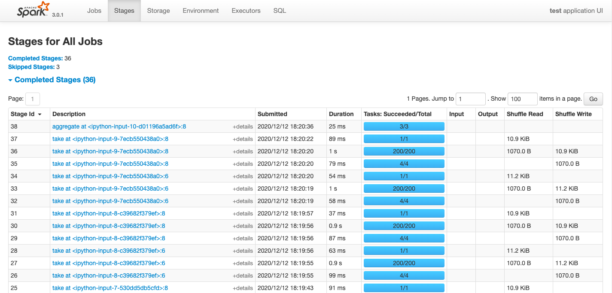
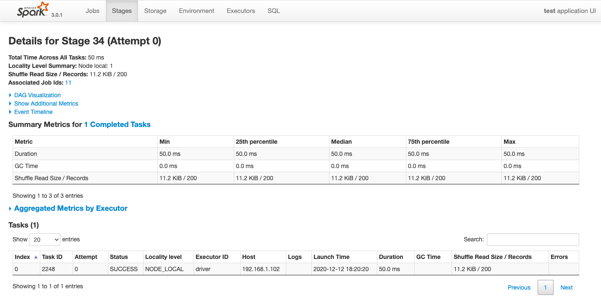

# 3-1,Spark性能调优方法


Spark程序可以快如闪电⚡️，也可以慢如蜗牛🐌。

它的性能取决于用户使用它的方式。

一般来说，如果有可能，用户应当尽可能多地使用SparkSQL以取得更好的性能。

主要原因是SparkSQL是一种声明式编程风格，背后的计算引擎会自动做大量的性能优化工作。

基于RDD的Spark的性能调优属于坑非常深的领域，并且很容易踩到。

我们将介绍Spark调优原理，Spark任务监控，以及Spark调优案例。

本文参考了以下文章：

《Spark性能优化指南——基础篇》：https://tech.meituan.com/2016/04/29/spark-tuning-basic.html

《Spark性能优化指南——高级篇》： https://tech.meituan.com/2016/05/12/spark-tuning-pro.html

《spark-调节executor堆外内存》：https://www.cnblogs.com/colorchild/p/12175328.html


```python
import findspark

#指定spark_home为刚才的解压路径,指定python路径
spark_home = "/Users/liangyun/ProgramFiles/spark-3.0.1-bin-hadoop3.2"
python_path = "/Users/liangyun/anaconda3/bin/python"
findspark.init(spark_home,python_path)

import pyspark 
from pyspark.sql import SparkSession

#SparkSQL的许多功能封装在SparkSession的方法接口中

spark = SparkSession.builder \
        .appName("test") \
        .config("master","local[4]") \
        .enableHiveSupport() \
        .getOrCreate()

sc = spark.sparkContext
```

```python

```

### 一，Spark调优原理

<!-- #region -->
可以用下面三个公式来近似估计spark任务的执行时间。


$$ 任务执行时间 ≈ \frac{任务计算总时间 + shuffle总时间 + GC垃圾回收总时间} {任务有效并行度}$$


$$ 任务有效并行度 ≈ \frac{min(任务并行度， partition分区数量)} {数据倾斜度\times 计算倾斜度} $$

$$ 任务并行度 ≈ executor数量 \times 每个executor的core数量 $$


可以用下面二个公式来说明spark在executor上的内存分配。

$$ executor申请的内存 ≈ 堆内内存(堆内内存由多个core共享) + 堆外内存 $$

$$ 堆内内存 ≈ storage内存+execution内存+other内存 $$


如果程序执行太慢，调优的顺序一般如下：

1，首先调整任务并行度，并调整partition分区。

2，尝试定位可能的重复计算，并优化之。

3，尝试定位数据倾斜问题或者计算倾斜问题并优化之。

4，如果shuffle过程提示堆外内存不足，考虑调高堆外内存。

5，如果发生OOM或者GC耗时过长，考虑提高executor-memory或降低executor-core。


以下是对上述公式中涉及到的一些概念的初步解读。


* 任务计算总时间：假设由一台无限内存的同等CPU配置的单核机器执行该任务，所需要的运行时间。通过缓存避免重复计算，通过mapPartitions代替map以减少诸如连接数据库，预处理广播变量等重复过程，都是减少任务计算总时间的例子。


* shuffle总时间：任务因为reduceByKey，join，sortBy等shuffle类算子会触发shuffle操作产生的磁盘读写和网络传输的总时间。shuffle操作的目的是将分布在集群中多个节点上的同一个key的数据，拉取到同一个节点上，以便让一个节点对同一个key的所有数据进行统一处理。 shuffle过程首先是前一个stage的一个shuffle write即写磁盘过程，中间是一个网络传输过程，然后是后一个stage的一个shuffle read即读磁盘过程。shuffle过程既包括磁盘读写，又包括网络传输，非常耗时。因此如有可能，应当避免使用shuffle类算子。例如用map+broadcast的方式代替join过程。退而求其次，也可以在shuffle之前对相同key的数据进行归并，减少shuffle读写和传输的数据量。此外，还可以应用一些较为高效的shuffle算子来代替低效的shuffle算子。例如用reduceByKey/aggregateByKey来代替groupByKey。最后，shuffle在进行网络传输的过程中会通过netty使用JVM堆外内存，spark任务中大规模数据的shuffle可能会导致堆外内存不足，导致任务挂掉，这时候需要在配置文件中调大堆外内存。


* GC垃圾回收总时间：当JVM中execution内存不足时，会启动GC垃圾回收过程。执行GC过程时候，用户线程会终止等待。因此如果execution内存不够充分，会触发较多的GC过程，消耗较多的时间。在spark2.0之后excution内存和storage内存是统一分配的，不必调整excution内存占比，可以提高executor-memory来降低这种可能。或者减少executor-cores来降低这种可能(这会导致任务并行度的降低)。


* 任务有效并行度：任务实际上平均被多少个core执行。它首先取决于可用的core数量。当partition分区数量少于可用的core数量时，只会有partition分区数量的core执行任务，因此一般设置分区数是可用core数量的2倍以上20倍以下。此外任务有效并行度严重受到数据倾斜和计算倾斜的影响。有时候我们会看到99%的partition上的数据几分钟就执行完成了，但是有1%的partition上的数据却要执行几个小时。这时候一般是发生了数据倾斜或者计算倾斜。这个时候，我们说，任务实际上有效的并行度会很低，因为在后面的这几个小时的绝大部分时间，只有很少的几个core在执行任务。


* 任务并行度：任务可用core的数量。它等于申请到的executor数量和每个executor的core数量的乘积。可以在spark-submit时候用num-executor和executor-cores来控制并行度。此外，也可以开启spark.dynamicAllocation.enabled根据任务耗时动态增减executor数量。虽然提高executor-cores也能够提高并行度，但是当计算需要占用较大的存储时，不宜设置较高的executor-cores数量，否则可能会导致executor内存不足发生内存溢出OOM。


* partition分区数量：分区数量越大，单个分区的数据量越小，任务在不同的core上的数量分配会越均匀，有助于提升任务有效并行度。但partition数量过大，会导致更多的数据加载时间，一般设置分区数是可用core数量的2倍以上20倍以下。可以在spark-submit中用spark.default.parallelism来控制RDD的默认分区数量，可以用spark.sql.shuffle.partitions来控制SparkSQL中给shuffle过程的分区数量。


* 数据倾斜度：数据倾斜指的是数据量在不同的partition上分配不均匀。一般来说，shuffle算子容易产生数据倾斜现象，某个key上聚合的数据量可能会百万千万之多，而大部分key聚合的数据量却只有几十几百个。一个partition上过大的数据量不仅需要耗费大量的计算时间，而且容易出现OOM。对于数据倾斜，一种简单的缓解方案是增大partition分区数量，但不能从根本上解决问题。一种较好的解决方案是利用随机数构造数量为原始key数量1000倍的中间key。大概步骤如下，利用1到1000的随机数和当前key组合成中间key，中间key的数据倾斜程度只有原来的1/1000, 先对中间key执行一次shuffle操作，得到一个数据量少得多的中间结果，然后再对我们关心的原始key进行shuffle，得到一个最终结果。


* 计算倾斜度：计算倾斜指的是不同partition上的数据量相差不大，但是计算耗时相差巨大。考虑这样一个例子，我们的RDD的每一行是一个列表，我们要计算每一行中这个列表中的数两两乘积之和，这个计算的复杂度是和列表长度的平方成正比的，因此如果有一个列表的长度是其它列表平均长度的10倍，那么计算这一行的时间将会是其它列表的100倍，从而产生计算倾斜。计算倾斜和数据倾斜的表现非常相似，我们会看到99%的partition上的数据几分钟就执行完成了，但是有1%的partition上的数据却要执行几个小时。计算倾斜和shuffle无关，在map端就可以发生。计算倾斜出现后，一般可以通过舍去极端数据或者改变计算方法优化性能。


* 堆内内存：on-heap memory, 即Java虚拟机直接管理的存储，由JVM负责垃圾回收GC。由多个core共享，core越多，每个core实际能使用的内存越少。core设置得过大容易导致OOM，并使得GC时间增加。


* 堆外内存：off-heap memory, 不受JVM管理的内存,  可以精确控制申请和释放, 没有GC问题。一般shuffle过程在进行网络传输的过程中会通过netty使用到堆外内存。

<!-- #endregion -->

```python

```

### 二，Spark任务UI监控


Spark任务启动后，可以在浏览器中输入 http://localhost:4040/ 进入到spark web UI 监控界面。

该界面中可以从多个维度以直观的方式非常细粒度地查看Spark任务的执行情况，包括任务进度，耗时分析，存储分析，shuffle数据量大小等。

最常查看的页面是 Stages页面和Excutors页面。

Jobs：
每一个Action操作对应一个Job，以Job粒度显示Application进度。有时间轴Timeline。


<br>
<br>

<!-- #region -->
**Stages**：
Job在遇到shuffle切开Stage，显示每个Stage进度，以及shuffle数据量。



<br>
<br>

可以点击某个Stage进入详情页，查看其下面每个Task的执行情况以及各个partition执行的费时统计。




Storage:  

监控cache或者persist导致的数据存储大小。


Environment:  
显示spark和scala版本，依赖的各种jar包及其版本。


**Excutors** : 
监控各个Excutors的存储和shuffle情况。


SQL: 
显示各种SQL命令在那些Jobs中被执行。


<!-- #endregion -->

```python

```

### 三，Spark调优案例


下面介绍几个调优的典型案例：

1，资源配置优化

2，利用缓存减少重复计算

3，数据倾斜调优 

4，broadcast+map代替join

5，reduceByKey/aggregateByKey代替groupByKey


<!-- #region -->
**1，资源配置优化**

下面是一个资源配置的例子：


优化前：

```bash
#提交python写的任务
spark-submit --master yarn \
--deploy-mode cluster \
--executor-memory 12G \
--driver-memory 12G \
--num-executors 100 \
--executor-cores 8 \
--conf spark.yarn.maxAppAttempts=2 \
--conf spark.task.maxFailures=10 \
--conf spark.stage.maxConsecutiveAttempts=10 \
--conf spark.yarn.appMasterEnv.PYSPARK_PYTHON=./anaconda3.zip/anaconda3/bin/python #指定excutors的Python环境
--conf spark.yarn.appMasterEnv.PYSPARK_DRIVER_PYTHON = ./anaconda3.zip/anaconda3/bin/python  #cluster模式时候设置
--archives viewfs:///user/hadoop-xxx/yyy/anaconda3.zip #上传到hdfs的Python环境
--files  data.csv,profile.txt
--py-files  pkg.py,tqdm.py
pyspark_demo.py 
```


优化后：

```bash
#提交python写的任务
spark-submit --master yarn \
--deploy-mode cluster \
--executor-memory 12G \
--driver-memory 12G \
--num-executors 100 \
--executor-cores 2 \
--conf spark.yarn.maxAppAttempts=2 \
--conf spark.default.parallelism=1600 \
--conf spark.sql.shuffle.partitions=1600 \
--conf spark.memory.offHeap.enabled=true \
--conf spark.memory.offHeap.size=2g\
--conf spark.task.maxFailures=10 \
--conf spark.stage.maxConsecutiveAttempts=10 \
--conf spark.yarn.appMasterEnv.PYSPARK_PYTHON=./anaconda3.zip/anaconda3/bin/python #指定excutors的Python环境
--conf spark.yarn.appMasterEnv.PYSPARK_DRIVER_PYTHON = ./anaconda3.zip/anaconda3/bin/python  #cluster模式时候设置
--archives viewfs:///user/hadoop-xxx/yyy/anaconda3.zip #上传到hdfs的Python环境
--files  data.csv,profile.txt
--py-files  pkg.py,tqdm.py
pyspark_demo.py 
```

这里主要减小了 executor-cores数量，一般设置为1~4，过大的数量可能会造成每个core计算和存储资源不足产生OOM，也会增加GC时间。
此外也将默认分区数调到了1600，并设置了2G的堆外内存。


<!-- #endregion -->

**2, 利用缓存减少重复计算**

```python
%%time
# 优化前:
import math 
rdd_x = sc.parallelize(range(0,2000000,3),3)
rdd_y = sc.parallelize(range(2000000,4000000,2),3)
rdd_z = sc.parallelize(range(4000000,6000000,2),3)
rdd_data = rdd_x.union(rdd_y).union(rdd_z).map(lambda x:math.tan(x))
s = rdd_data.reduce(lambda a,b:a+b+0.0)
n = rdd_data.count()
mean = s/n 
print(mean)

```

```
-1.889935655259299
CPU times: user 40.2 ms, sys: 12.4 ms, total: 52.6 ms
Wall time: 2.76 s
```

```python
%%time 
# 优化后: 
import math 
from  pyspark.storagelevel import StorageLevel
rdd_x = sc.parallelize(range(0,2000000,3),3)
rdd_y = sc.parallelize(range(2000000,4000000,2),3)
rdd_z = sc.parallelize(range(4000000,6000000,2),3)
rdd_data = rdd_x.union(rdd_y).union(rdd_z).map(lambda x:math.tan(x)).persist(StorageLevel.MEMORY_AND_DISK)

s = rdd_data.reduce(lambda a,b:a+b+0.0)
n = rdd_data.count()
mean = s/n 
rdd_data.unpersist()
print(mean)

```

```
-1.889935655259299
CPU times: user 40.5 ms, sys: 11.5 ms, total: 52 ms
Wall time: 2.18 s
```

```python

```

**3, 数据倾斜调优**

```python
%%time 
# 优化前: 
rdd_data = sc.parallelize(["hello world"]*1000000+["good morning"]*10000+["I love spark"]*10000)
rdd_word = rdd_data.flatMap(lambda x:x.split(" "))
rdd_one = rdd_word.map(lambda x:(x,1))
rdd_count = rdd_one.reduceByKey(lambda a,b:a+b+0.0)
print(rdd_count.collect()) 

```

```
[('good', 10000.0), ('hello', 1000000.0), ('spark', 10000.0), ('world', 1000000.0), ('love', 10000.0), ('morning', 10000.0), ('I', 10000.0)]
CPU times: user 285 ms, sys: 27.6 ms, total: 313 ms
Wall time: 2.74 s
```

```python
%%time 
# 优化后: 
import random 
rdd_data = sc.parallelize(["hello world"]*1000000+["good morning"]*10000+["I love spark"]*10000)
rdd_word = rdd_data.flatMap(lambda x:x.split(" "))
rdd_one = rdd_word.map(lambda x:(x,1))
rdd_mid_key = rdd_one.map(lambda x:(x[0]+"_"+str(random.randint(0,999)),x[1]))
rdd_mid_count = rdd_mid_key.reduceByKey(lambda a,b:a+b+0.0)
rdd_count = rdd_mid_count.map(lambda x:(x[0].split("_")[0],x[1])).reduceByKey(lambda a,b:a+b+0.0)
print(rdd_count.collect())  

#作者按：此处仅示范原理，单机上该优化方案难以获得性能优势

```

```
[('good', 10000.0), ('hello', 1000000.0), ('spark', 10000.0), ('world', 1000000.0), ('love', 10000.0), ('morning', 10000.0), ('I', 10000.0)]
CPU times: user 351 ms, sys: 51 ms, total: 402 ms
Wall time: 7 s
```

```python

```

**4, broadcast+map代替join**


该优化策略一般限于有一个参与join的rdd的数据量不大的情况。


```python
%%time 
# 优化前:

rdd_age = sc.parallelize([("LiLei",18),("HanMeimei",19),("Jim",17),("LiLy",20)])
rdd_gender = sc.parallelize([("LiLei","male"),("HanMeimei","female"),("Jim","male"),("LiLy","female")])
rdd_students = rdd_age.join(rdd_gender).map(lambda x:(x[0],x[1][0],x[1][1]))

print(rdd_students.collect())

```

```
[('LiLy', 20, 'female'), ('LiLei', 18, 'male'), ('HanMeimei', 19, 'female'), ('Jim', 17, 'male')]
CPU times: user 43.9 ms, sys: 11.6 ms, total: 55.6 ms
Wall time: 307 ms
```

```python
%%time 

# 优化后:
rdd_age = sc.parallelize([("LiLei",18),("HanMeimei",19),("Jim",17),("LiLy",20)])
rdd_gender = sc.parallelize([("LiLei","male"),("HanMeimei","female"),("Jim","male"),("LiLy","female")],2)
ages = rdd_age.collect()
broads = sc.broadcast(ages)

def get_age(it):
    result = []
    ages = dict(broads.value)
    for x in it:
        name = x[0]
        age = ages.get(name,0)
        result.append((x[0],age,x[1]))
    return iter(result)

rdd_students = rdd_gender.mapPartitions(get_age)

print(rdd_students.collect())

```

```
[('LiLei', 18, 'male'), ('HanMeimei', 19, 'female'), ('Jim', 17, 'male'), ('LiLy', 20, 'female')]
CPU times: user 14.3 ms, sys: 7.43 ms, total: 21.7 ms
Wall time: 86.3 ms
```

```python

```

**5，reduceByKey/aggregateByKey代替groupByKey**


groupByKey算子是一个低效的算子，其会产生大量的shuffle。其功能可以用reduceByKey和aggreagateByKey代替，通过在每个partition内部先做一次数据的合并操作，大大减少了shuffle的数据量。


```python
%%time 
# 优化前:
rdd_students = sc.parallelize([("class1","LiLei"),("class2","HanMeimei"),("class1","Lucy"),
                               ("class1","Ann"),("class1","Jim"),("class2","Lily")])
rdd_names = rdd_students.groupByKey().map(lambda t:(t[0],list(t[1])))
names = rdd_names.collect()
print(names)

```

```
[('class1', ['LiLei', 'Lucy', 'Ann', 'Jim']), ('class2', ['HanMeimei', 'Lily'])]
CPU times: user 25.3 ms, sys: 7.32 ms, total: 32.6 ms
Wall time: 164 ms
```

```python
%%time 
# 优化后:
rdd_students = sc.parallelize([("class1","LiLei"),("class2","HanMeimei"),("class1","Lucy"),
                               ("class1","Ann"),("class1","Jim"),("class2","Lily")])
rdd_names = rdd_students.aggregateByKey([],lambda arr,name:arr+[name],lambda arr1,arr2:arr1+arr2)

names = rdd_names.collect()
print(names)
```

```
[('class1', ['LiLei', 'Lucy', 'Ann', 'Jim']), ('class2', ['HanMeimei', 'Lily'])]
CPU times: user 21.6 ms, sys: 6.63 ms, total: 28.3 ms
Wall time: 118 ms
```

```python

```

**如果本书对你有所帮助，想鼓励一下作者，记得给本项目加一颗星星star⭐️，并分享给你的朋友们喔😊!** 

如果对本书内容理解上有需要进一步和作者交流的地方，欢迎在公众号"算法美食屋"下留言。作者时间和精力有限，会酌情予以回复。

也可以在公众号后台回复关键字：**spark加群**，加入spark和大数据读者交流群和大家讨论。


