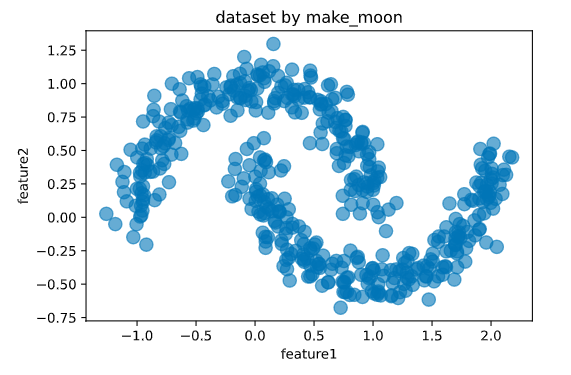
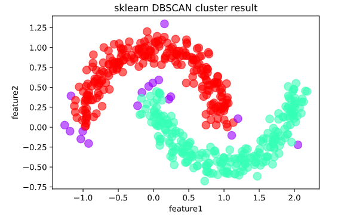
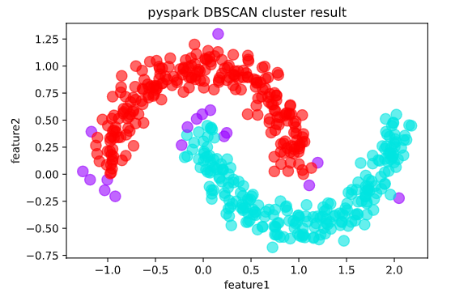

# 3-2,RDD和SparkSQL综合应用


在pyspark大数据项目实践中，我们往往要综合应用SparkSQL和RDD来完成任务。

通常，我们会使用SparkSQL的DataFrame来负责项目中数据读写相关的任务。

对于一些能够表达为表合并，表拼接，表分组等常规SQL操作的任务，我们也自然倾向于使用DataFrame来表达我们的逻辑。

但在一些真实项目场景中，可能会需要实现一些非常复杂和精细的逻辑，我们不知道如何使用DataFrame来直接实现这些逻辑。

或者使用DataFrame来实现它们过于复杂，不是简单地写几个自定义函数就可以。

我们往往会将DataFrame转化为RDD，在RDD中应用Python中的列表和字典等数据结构的操作来实现这个逻辑，然后再将RDD转回成DataFrame。

下面以一个DBSCAN聚类算法的分布式实现为例，来说明综合应用SparkSQL和RDD的方法。

这个案例的难度是工业级的，读者不一定能够完全理解，不用过分担心。

我相信，即使阅读这个案例后仅理解很少的一部分，也会让读者对Spark在真实项目场景中的应用技巧建立起更好的感觉。


```python
import findspark

#指定spark_home为刚才的解压路径,指定python路径
spark_home = "/Users/liangyun/ProgramFiles/spark-3.0.1-bin-hadoop3.2"
python_path = "/Users/liangyun/anaconda3/bin/python"
findspark.init(spark_home,python_path)

import pyspark 
from pyspark.sql import SparkSession
from pyspark.storagelevel import StorageLevel 

#SparkSQL的许多功能封装在SparkSession的方法接口中

spark = SparkSession.builder \
        .appName("dbscan") \
        .config("master","local[4]") \
        .enableHiveSupport() \
        .getOrCreate()

sc = spark.sparkContext
```

```python

```

### 一，DBSCAN算法简介

<!-- #region -->
DBSCAN是一种非常著名的基于密度的聚类算法。其英文全称是 Density-Based Spatial Clustering of Applications with Noise，意即：一种基于密度，对噪声鲁棒的空间聚类算法。直观效果上看，DBSCAN算法可以找到样本点的全部密集区域，并把这些密集区域当做一个一个的聚类簇。

DBSCAN算法具有以下特点：

* 基于密度，对远离密度核心的噪声点鲁棒
* 无需知道聚类簇的数量
* 可以发现任意形状的聚类簇


DBSCAN的算法步骤分成两步。

1，寻找核心点形成临时聚类簇。

2，合并临时聚类簇得到聚类簇。


完整教程可以参考知乎文章：

《20分钟学会DBSCAN聚类算法》：https://zhuanlan.zhihu.com/p/336501183


<!-- #endregion -->

```python

```

### 二，sklearn调包范例


1，生成样本点

```python
%matplotlib inline
%config InlineBackend.figure_format = 'svg'
import numpy as np
import pandas as pd
from sklearn import datasets


X,_ = datasets.make_moons(500,noise = 0.1,random_state=1)
pdf = pd.DataFrame(X,columns = ['feature1','feature2'])

pdf.plot.scatter('feature1','feature2', s = 100,alpha = 0.6, title = 'dataset by make_moon');

```



```python

```

2，调用dbscan方法完成聚类

```python
%matplotlib inline
%config InlineBackend.figure_format = 'svg'

from sklearn.cluster import dbscan

# eps为邻域半径，min_samples为最少点数目
core_samples,cluster_ids = dbscan(X, eps = 0.2, min_samples=20) 
# cluster_ids中-1表示对应的点为噪声点

pdf = pd.DataFrame(np.c_[X,cluster_ids],columns = ['feature1','feature2','cluster_id'])
pdf['cluster_id'] = pdf['cluster_id'].astype('i2')

pdf.plot.scatter('feature1','feature2', s = 100,
    c = list(pdf['cluster_id']),cmap = 'rainbow',colorbar = False,
    alpha = 0.6,title = 'sklearn DBSCAN cluster result');
```



```python

```

### 三，分布式实现思路

<!-- #region -->
DBSCAN算法的分布式实现需要解决以下一些主要的问题。

1，如何计算样本点中两两之间的距离？

在单机环境下，计算样本点两两之间的距离比较简单，是一个双重遍历的过程。 为了减少计算量，可以用空间索引如KDtree进行加速。

在分布式环境，样本点分布在不同的分区，难以在不同的分区之间直接进行双重遍历。 为了解决这个问题，我的方案是将样本点不同的分区分成多个批次拉到Driver端， 然后依次广播到各个excutor分别计算距离，将最终结果union，从而间接实现双重遍历。


2，如何构造临时聚类簇？

这个问题不难，单机环境和分布式环境的实现差不多。

都是通过group的方式统计每个样本点周边邻域半径R内的样本点数量，

并记录它们的id,如果这些样本点数量超过minpoints则构造临时聚类簇，并维护核心点列表。


3，如何合并相连的临时聚类簇得到聚类簇？


这个是分布式实现中最最核心的步骤。

在单机环境下，标准做法是对每一个临时聚类簇，

判断其中的样本点是否在核心点列表，如果是，则将该样本点所在的临时聚类簇与当前临时聚类簇合并。并在核心点列表中删除该样本点。

重复此过程，直到当前临时聚类簇中所有的点都不在核心点列表。

在分布式环境下，临时聚类簇分布在不同的分区，无法直接扫描全局核心点列表进行临时聚类簇的合并。

我的方案是先在每一个分区内部对各个临时聚类簇进行合并，然后缩小分区数量重新分区，再在各个分区内部对每个临时聚类簇进行合并。

不断重复这个过程，最终将所有的临时聚类簇都划分到一个分区，完成对全部临时聚类簇的合并。

为了降低最后一个分区的存储压力，我采用了不同于标准的临时聚类簇的合并算法。

对每个临时聚类簇只关注其中的核心点id,而不关注非核心点id,以减少存储压力。合并时将有共同核心点id的临时聚类簇合并。


<!-- #endregion -->

```python

```

### 四，分布式实现核心逻辑


以下为DBSCAN的分布式实现的核心逻辑。即从临时聚类簇合并成聚类簇的方案，该逻辑较为精细，采用RDD来实现。


1，寻找核心点形成临时聚类簇。

假定已经得到了临时聚类簇，信息存储为rdd_core

```python
#rdd_core的每一行代表一个临时聚类簇：(min_core_id, core_id_set)
#core_id_set为临时聚类簇所有核心点的编号，min_core_id为这些编号中取值最小的编号
rdd_core = sc.parallelize([(1,{1,2}),(2,{2,3,4}),(6,{6,8,9}),
        (4,{4,5}),(9,{9,10,11}),(15,{15,17}),(10,{10,11,18})],20)
data_core = rdd_core.collect()
data_core
```

```
[(1, {1, 2}),
 (2, {2, 3, 4}),
 (6, {6, 8, 9}),
 (4, {4, 5}),
 (9, {9, 10, 11}),
 (15, {15, 17}),
 (10, {10, 11, 18})]
```

```python
#定义合并函数：将有共同核心点的临时聚类簇合并
def mergeSets(list_set):
    result = []
    while  len(list_set)>0 :
        cur_set = list_set.pop(0)
        intersect_idxs = [i for i in list(range(len(list_set)-1,-1,-1)) if cur_set&list_set[i]]
        while  intersect_idxs :
            for idx in intersect_idxs:
                cur_set = cur_set|list_set[idx]

            for idx in intersect_idxs:
                list_set.pop(idx)
                
            intersect_idxs = [i for i in list(range(len(list_set)-1,-1,-1)) if cur_set&list_set[i]]
        
        result = result+[cur_set]
    return result

# 测试mergeSets效果
test_list_set = [{1,2,3},{3,4,5},{10,12,13},{4,5,8},{13,15},{7,8},{20,22}]
print(mergeSets(test_list_set))

```

```
[{1, 2, 3, 4, 5, 7, 8}, {10, 12, 13, 15}, {20, 22}]
```

```python

```

```python
#对rdd_core分区后在每个分区合并，不断将分区数量减少，最终合并到一个分区
#如果数据规模十分大，难以合并到一个分区，也可以最终合并到多个分区，得到近似结果。
#rdd: (min_core_id,core_id_set)


def mergeRDD(rdd,partition_cnt):
    def fn(iterator):
        list_set = [x[1] for x in iterator]
        list_set_merged = mergeSets(list_set)
        merged_core = [(min(x),x) for x in list_set_merged] 
        return(iter(merged_core))
    rdd_merged = rdd.partitionBy(partition_cnt).mapPartitions(fn)
    return rdd_merged

rdd_core = sc.parallelize([(1,{1,2}),(2,{2,3,4}),(6,{6,8,9}),
        (4,{4,5}),(9,{9,10,11}),(15,{15,17}),(10,{10,11,18})],20)

#分区迭代计算，可以根据需要调整迭代次数和分区数量
rdd_core = mergeRDD(rdd_core,8)
rdd_core = mergeRDD(rdd_core,4)
rdd_core = mergeRDD(rdd_core,1)
rdd_core.collect() 
```

```
[(1, {1, 2, 3, 4, 5}), (6, {6, 8, 9, 10, 11, 18}), (15, {15, 17})]
```

```python

```

### 五，分布式实现完整代码


**1，生成样本点** 

```python
%matplotlib inline
%config InlineBackend.figure_format = 'svg'

import numpy as np
import pandas as pd
from sklearn import datasets

#设置DBSCAN参数
eps = 0.2
min_samples=20

X,_ = datasets.make_moons(500,noise = 0.1,random_state=1)
pdf = pd.DataFrame(X,columns = ['feature1','feature2'])
pdf.plot.scatter('feature1','feature2', s = 100,alpha = 0.6, title = 'dataset by make_moon')

pdf.to_csv("./data/moon_dataset.csv",sep = "\t",index = False)

#转换成spark中的DataFrame
#dfdata = spark.createDataFrame(pdf)
dfdata = spark.read.option("header","true")\
  .option("inferSchema","true") \
  .option("delimiter", "\t") \
  .csv("data/moon_dataset.csv")

#将点的坐标生成一个array,并添加唯一id列

dfinput = spark.createDataFrame(dfdata.selectExpr("array(feature1,feature2) as point") \
    .rdd.map(lambda row:row["point"]).zipWithIndex()).toDF("point","id") \
    .selectExpr("id","point").persist(StorageLevel.MEMORY_AND_DISK)

dfinput.show() 
```

```
+---+--------------------+
| id|               point|
+---+--------------------+
|  0|[0.31655567612451...|
|  1|[0.74088269972429...|
|  2|[0.87172637133182...|
|  3|[0.55552787799773...|
|  4|[2.03872887867669...|
|  5|[1.99136342379999...|
|  6|[0.22384428620202...|
|  7|[0.97295674842244...|
|  8|[-0.9213036629723...|
|  9|[0.46670632489966...|
| 10|[0.49217803972132...|
| 11|[-0.4223529513452...|
| 12|[0.31358610070888...|
| 13|[0.64848081923216...|
| 14|[0.31549460745917...|
| 15|[-0.9118786633207...|
| 16|[1.70164131101163...|
| 17|[0.10851453318658...|
| 18|[-0.3098724480520...|
| 19|[-0.2040816479108...|
+---+--------------------+
only showing top 20 rows

```


```python

```

**2，分批次广播KDTree得到邻近关系** 

```python
import numpy as np 
from pyspark.sql import types as T
from pyspark.sql import functions as F 
from pyspark.sql import Row,DataFrame
from sklearn.neighbors import KDTree


rdd_input = dfinput.rdd.repartition(20).persist(StorageLevel.MEMORY_AND_DISK)

#创建空dataframe
schema = T.StructType([
        T.StructField("m_id", T.LongType(), True),
        T.StructField("s_id", T.LongType(), True),
        T.StructField("m_point", T.ArrayType(T.DoubleType(),False), True),
        T.StructField("s_point", T.ArrayType(T.DoubleType(),False), True)])
 
dfpair_raw = spark.createDataFrame(spark.sparkContext.emptyRDD(), schema)


#分批次进行广播
partition_cnt = 10
dfmaster = dfinput.repartition(partition_cnt)

for i in range(0,partition_cnt):
    rdd_master_i = dfmaster.rdd.mapPartitionsWithIndex(
        lambda idx, iterator: iterator if (idx == i ) else iter([]) )
    master_i = rdd_master_i.collect()
    idxs_i = [x["id"] for x in master_i]
    points_i = [x["point"] for x in master_i]
    tree_i = KDTree(np.array(points_i), leaf_size=40, metric='minkowski') #构建kdtree
    broad_i = sc.broadcast((idxs_i,points_i,tree_i))
    
    def fn(iterator):
        list_res = [] #m_id,s_id,m_point,s_point
        idxs_i,points_i,tree_i = broad_i.value
        for row in iterator:
            s_id = row["id"]
            s_point = row["point"]
            index = tree_i.query_radius(np.array([s_point]), r=2*eps)[0] #根据kdtree查询一定范围内的点
            for j in index:
                list_res.append([idxs_i[j],s_id,points_i[j],s_point])
        return iter(list_res)
    
    dfpair_raw_i = spark.createDataFrame(rdd_input.mapPartitions(fn)).toDF("m_id","s_id","m_point","s_point")
    dfpair_raw = dfpair_raw.union(dfpair_raw_i)
    
```

```python

```

**3，根据DBSCAN邻域半径得到有效邻近关系 dfpair** 

```python

# 根据DBSCAN邻域半径得到有效邻近关系 dfpair

spark.udf.register("distance", lambda p,q:((p[0]-q[0])**2+(p[1]-q[1])**2)**0.5)
dfpair = dfpair_raw.where("distance(s_point,m_point) <"+str(eps)) \
    .persist(StorageLevel.MEMORY_AND_DISK)

dfpair.show()
```

```
+----+----+--------------------+--------------------+
|m_id|s_id|             m_point|             s_point|
+----+----+--------------------+--------------------+
| 453| 190|[-0.9305763617157...|[-0.9342271003887...|
| 310| 190|[-0.8647371774956...|[-0.9342271003887...|
| 468| 191|[-1.1236573115927...|[-1.1107926480996...|
| 379| 193|[0.29384781266215...|[0.30668711048764...|
| 315| 193|[0.27137000939033...|[0.30668711048764...|
|  45| 193|[0.41589898081748...|[0.30668711048764...|
| 206| 194|[-0.0479181540769...|[-0.1280156580069...|
| 124| 194|[-0.0717324612290...|[-0.1280156580069...|
| 194| 194|[-0.1280156580069...|[-0.1280156580069...|
| 166| 194|[0.01894280256753...|[-0.1280156580069...|
| 348| 195|[0.77799441414636...|[0.91064797784686...|
| 104| 195|[0.97950311224508...|[0.91064797784686...|
| 243| 196|[-0.7132555992338...|[-0.7605955193004...|
| 482| 196|[-0.6342018198835...|[-0.7605955193004...|
| 174| 196|[-0.7070084501262...|[-0.7605955193004...|
| 196| 196|[-0.7605955193004...|[-0.7605955193004...|
| 367| 197|[0.00547311527928...|[0.02875754813338...|
| 437| 197|[0.04652353436126...|[0.02875754813338...|
| 237| 197|[0.08078546751286...|[0.02875754813338...|
| 226| 197|[0.07689272752608...|[0.02875754813338...|
+----+----+--------------------+--------------------+
only showing top 20 rows
```

```python

```

```python

```

**4，创建临时聚类簇 dfcore**

```python
dfcore = dfpair.groupBy("s_id").agg(
  F.first("s_point").alias("s_point"),
  F.count("m_id").alias("neighbour_cnt"),
  F.collect_list("m_id").alias("neighbour_ids")
).where("neighbour_cnt>="+str(min_samples)) \
 .persist(StorageLevel.MEMORY_AND_DISK)

dfcore.show(3)
```

```
+----+--------------------+-------------+--------------------+
|s_id|             s_point|neighbour_cnt|       neighbour_ids|
+----+--------------------+-------------+--------------------+
|  26|[0.95199382446206...|           25|[150, 463, 300, 5...|
| 418|[0.04187413307127...|           22|[367, 454, 226, 4...|
|  65|[0.46872165251145...|           30|[45, 402, 44, 456...|
+----+--------------------+-------------+--------------------+
only showing top 3 rows
```

```python

```

**5，得到临时聚类簇的核心点信息**

```python
dfpair_join = dfcore.selectExpr("s_id").join(dfpair,["s_id"],"inner")
df_fids = dfcore.selectExpr("s_id as m_id")
dfpair_core = df_fids.join(dfpair_join,["m_id"],"inner")
rdd_core = dfpair_core.groupBy("s_id").agg(
  F.min("m_id").alias("min_core_id"),
  F.collect_set("m_id").alias("core_id_set")
).rdd.map(lambda row: (row["min_core_id"], set(row["core_id_set"])))

rdd_core.persist(StorageLevel.MEMORY_AND_DISK)

print("before_dbscan, rdd_core.count() = ",rdd_core.count())

```

```python

```

**6，对rdd_core分区分步合并  rdd_core(min_core_id, core_id_set) **

```python
#定义合并函数：将有共同核心点的临时聚类簇合并
def mergeSets(list_set):
    result = []
    while  len(list_set)>0 :
        cur_set = list_set.pop(0)
        intersect_idxs = [i for i in list(range(len(list_set)-1,-1,-1)) if cur_set&list_set[i]]
        while  intersect_idxs :
            for idx in intersect_idxs:
                cur_set = cur_set|list_set[idx]

            for idx in intersect_idxs:
                list_set.pop(idx)
                
            intersect_idxs = [i for i in list(range(len(list_set)-1,-1,-1)) if cur_set&list_set[i]]
        
        result = result+[cur_set]
    return result

#对rdd_core分区后在每个分区合并，不断将分区数量减少，最终合并到一个分区
#如果数据规模十分大，难以合并到一个分区，也可以最终合并到多个分区，得到近似结果。
#rdd: (min_core_id,core_id_set)
def mergeRDD(rdd,partition_cnt):
    def fn(iterator):
        list_set = [x[1] for x in iterator]
        list_set_merged = mergeSets(list_set)
        merged_core = [(min(x),x) for x in list_set_merged] 
        return(iter(merged_core))
    rdd_merged = rdd.partitionBy(partition_cnt).mapPartitions(fn)
    return rdd_merged


#此处需要视实际情况调整分区数量和迭代次数
for pcnt in (16,8,4,1):
    rdd_core = mergeRDD(rdd_core,pcnt)
    
rdd_core.persist(StorageLevel.MEMORY_AND_DISK)

print("after dbscan: rdd_core.count()=",rdd_core.count())

```

```
after dbscan: rdd_core.count()= 2
```


**7, 获取每一个core的簇信息**

```python
dfcluster_ids = spark.createDataFrame(
    rdd_core.flatMap(lambda t: [(t[0], s_id) for s_id in t[1]])).toDF("cluster_id","s_id")

dfclusters =  dfcore.join(dfcluster_ids, "s_id", "left")

dfclusters.show() 
```

```
+----+--------------------+-------------+--------------------+----------+
|s_id|             s_point|neighbour_cnt|       neighbour_ids|cluster_id|
+----+--------------------+-------------+--------------------+----------+
|  26|[0.95199382446206...|           25|[150, 463, 300, 5...|         2|
|  65|[0.46872165251145...|           30|[45, 402, 44, 456...|         0|
| 418|[0.04187413307127...|           22|[367, 454, 226, 4...|         0|
| 293|[0.74589456598500...|           30|[231, 293, 153, 3...|         2|
| 243|[-0.7132555992338...|           21|[243, 482, 174, 1...|         2|
| 278|[-0.8841688633151...|           27|[453, 310, 196, 9...|         2|
| 367|[0.00547311527928...|           24|[367, 437, 454, 2...|         0|
|  19|[-0.2040816479108...|           25|[206, 124, 194, 2...|         2|
|  54|[1.86506527195881...|           22|[331, 116, 92, 54...|         0|
| 296|[1.43490708002292...|           22|[212, 199, 473, 3...|         0|
|   0|[0.31655567612451...|           22|[315, 46, 456, 42...|         0|
| 348|[0.77799441414636...|           25|[348, 402, 374, 4...|         0|
| 415|[-0.4510104506178...|           28|[363, 407, 273, 2...|         2|
| 112|[1.38118745635267...|           28|[212, 199, 473, 3...|         0|
| 113|[1.95088315015933...|           26|[306, 255, 447, 2...|         0|
| 167|[0.39542492867803...|           22|[286, 179, 109, 1...|         2|
| 385|[-0.2769033877846...|           25|[363, 407, 122, 2...|         2|
| 237|[0.08078546751286...|           29|[367, 437, 46, 23...|         0|
| 347|[-0.7336250327143...|           21|[482, 174, 196, 9...|         2|
| 330|[0.71478678633618...|           27|[231, 293, 153, 3...|         2|
+----+--------------------+-------------+--------------------+----------+
only showing top 20 rows

```


**8，求每一个簇的代表核心和簇元素数量**

```python
rdd_cluster = dfclusters.rdd.map(
    lambda row: (row["cluster_id"],(row["s_point"],row["neighbour_cnt"],set(row["neighbour_ids"])))
)

def reduce_fn(a,b):
    id_set = a[2]|b[2]
    result = (a[0],a[1],id_set) if a[1]>=b[1] else (b[0],b[1],id_set)
    return result

rdd_result = rdd_cluster.reduceByKey(reduce_fn)

def map_fn(t):
    cluster_id = t[0]
    representation_point = t[1][0]
    neighbour_points_cnt = t[1][1]
    id_set = list(t[1][2])
    cluster_points_cnt = len(id_set)
    return (cluster_id,representation_point,neighbour_points_cnt,cluster_points_cnt,id_set)

dfresult = spark.createDataFrame(rdd_result.map(map_fn)
    ).toDF("cluster_id","representation_point","neighbour_points_cnt","cluster_points_cnt","cluster_points_ids")

dfresult.persist(StorageLevel.MEMORY_AND_DISK)

dfresult.show(3)

```

```
+----------+--------------------+--------------------+------------------+--------------------+
|cluster_id|representation_point|neighbour_points_cnt|cluster_points_cnt|  cluster_points_ids|
+----------+--------------------+--------------------+------------------+--------------------+
|         0|[1.95163238902570...|                  32|               242|[0, 1, 4, 5, 6, 1...|
|         2|[0.95067226301300...|                  34|               241|[2, 3, 7, 9, 11, ...|
+----------+--------------------+--------------------+------------------+--------------------+

```


注意到我们的结果中

聚类簇数量为2个。

噪声点数量为500-242-241 = 17个

和调用sklearn中的结果完全一致。

```python

```

**9，求每一个点的簇id，噪声点簇id赋值为-1**

```python
rdd_clusterid = dfresult.select("cluster_id","cluster_points_ids").rdd.flatMap(
    lambda t: [(x,t["cluster_id"]) for x in t["cluster_points_ids"]])

df_clusterid = spark.createDataFrame(rdd_clusterid).toDF("id","cluster_id")
dfoutput_raw = dfinput.join(df_clusterid,"id","left")
dfoutput = dfoutput_raw.na.fill(-1)

dfoutput = dfoutput.selectExpr("id","cluster_id","point[0] as feature1","point[1] as feature2")
dfoutput.persist(StorageLevel.MEMORY_AND_DISK)
dfoutput.show()

```

```
+---+----------+--------------------+--------------------+
| id|cluster_id|            feature1|            feature2|
+---+----------+--------------------+--------------------+
| 26|         2|  0.9519938244620684|  0.2552474492493959|
| 29|         2|  -0.863622604833635|   0.756640145262391|
|474|         2| -0.4885096982719171|  1.0491748634589007|
| 65|         0|  0.4687216525114598| -0.3609345154042032|
|191|         2|  -1.110792648099675| 0.18780773522847397|
|418|         0| 0.04187413307127004| 0.25141384401180206|
|222|         0|  1.5899557693512685|-0.42942807171107017|
|270|         0|   2.178538623657351| 0.44807664826862253|
|293|         2|  0.7458945659850041|  0.5914004203001728|
|243|         2| -0.7132555992338488|  0.8089869542594612|
|278|         2| -0.8841688633151701|  0.5147890731484406|
|367|         0|0.005473115279280807| 0.12361319219864111|
|442|         2|  0.8889028924942911|0.028497180983055058|
| 19|         2| -0.2040816479108034|  0.9856890760075208|
| 54|         0|  1.8650652719588168|-0.13541631999968182|
|296|         0|   1.434907080022921| -0.4713434821495917|
|  0|         0|  0.3165556761245117|-0.04942181785843226|
|277|         0| 0.08946739589070024|-0.22831869307482952|
|287|         0|  1.7814103104861185|-0.33109829058582907|
|348|         0|   0.777994414146364| -0.4522352978300379|
+---+----------+--------------------+--------------------+
only showing top 20 rows
```


**10，保存和可视化结果**

```python
dfoutput.write.format("csv") \
  .option("header","true")\
  .option("inferSchema","true") \
  .option("delimiter", "\t") \
  .save("data/dbscan_output.csv")
```

```python
pdfoutput = dfoutput.toPandas()

pdfoutput.plot.scatter('feature1','feature2', s = 100,
    c = list(pdfoutput['cluster_id']),cmap = 'rainbow',colorbar = False,
    alpha = 0.6,title = 'pyspark DBSCAN cluster result');
```




**如果本书对你有所帮助，想鼓励一下作者，记得给本项目加一颗星星star⭐️，并分享给你的朋友们喔😊!** 

如果对本书内容理解上有需要进一步和作者交流的地方，欢迎在公众号"算法美食屋"下留言。作者时间和精力有限，会酌情予以回复。

也可以在公众号后台回复关键字：**spark加群**，加入spark和大数据读者交流群和大家讨论。


